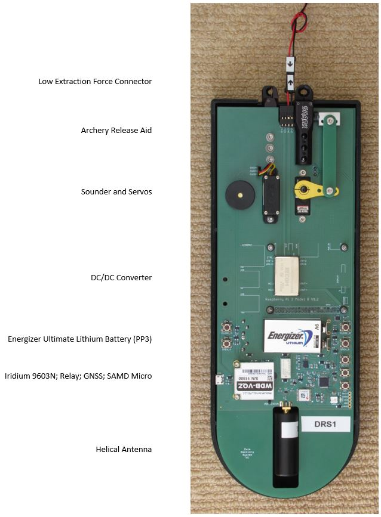
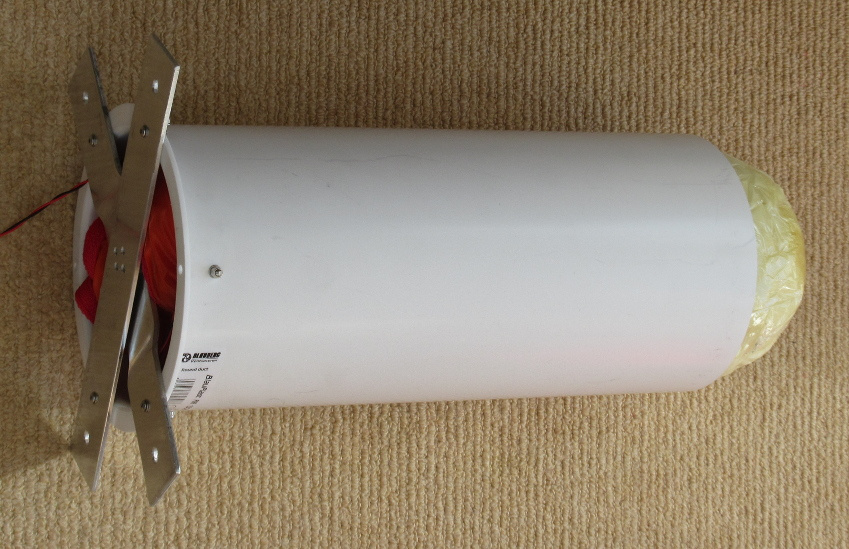
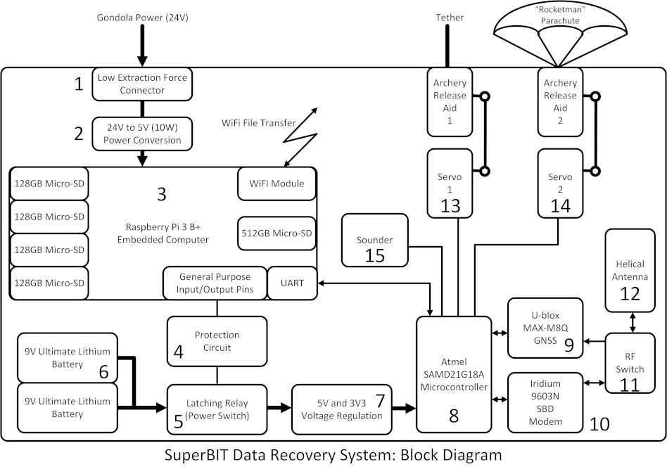

# Data_Recovery_System

### ! Still Work In Progress - but more complete than it was !

This is the repository for the SuperBIT Data Recovery System (a.k.a. the data drop capsule).

The DRS comprises:
- Raspberry Pi equipped with: 1 x 512GB and 4 x 128GB (RAID1) SD data storage
- ATSAMD21G18 microcontroller as used on the Adafruit Feather M0 Adalogger and the Arduino Zero
- [u-blox MAX-M8Q GNSS receiver](https://www.u-blox.com/en/product/max-m8-series)
- Iridium 9603N Short Burst Data modem
- Maxtena M1600HCT-P-SMA antenna, shared via a Skyworks AS179-92LF RF switch
- two [servo-actuated](https://www.servoshop.co.uk/index.php?pid=HITHS82MG&area=Servo)
[Scott Archery release aids](https://scottarchery.com/collections/releases/products/shark-release): one for the tether and one for the parachute
- [Rocketman 4' parachute](https://the-rocketman.com/recovery-html/)
- Low extraction force power connector
- 3D-printed cover
- PU foam enclosure
- PVC launch tube

See [LEARN.md](./LEARN.md) for more details.

[PCB.md](./PCB.md) contains instructions on how to populate and test the PCB.

[PI.md](./PI.md) contains instructions on how to configure the Raspberry Pi.

[ASSEMBLY.md](./ASSEMBLY.md) contains instructions on how to prepare the DRS for flight.

[GoGoGo.md](./GoGoGo.md) contains instructions on how to release and track the DRS.

The schematic, PCB layout and Bill Of Materials can be found in [Data_Recovery_System_V1.pdf](./Data_Recovery_System_V1.pdf)

The BOM is also available in [Excel .xlsx format](./Data_Recovery_System_BOM.xlsx)

The [Eagle](./Eagle) directory contains the schematic and pcb design files.

The [Arduino](./Arduino) directory contains the Arduino code for the SAMD microcontroller.

The [Drawings](./Drawings) directory contains the drawings for the trigger linkage.

The [OpenSCAD](./OpenSCAD) directory contains the OpenSCAD and STL files for the 3D-printed cover, release crown/mount, and heatsink.

The Python software tools which need to be installed on the Raspberry Pi can be found the [DRS_Python_Tools repo](https://github.com/PaulZC/DRS_Python_Tools).

See [SERVO.md](./SERVO.md) for details on how to modify the HiTec servo for
high altitude operation.

See [SHARK.md](./SHARK.md) for details on how to modify the Scott Archery Shark release aid.

## Licence

This project is distributed under a Creative Commons Attribution + Share-alike (BY-SA) licence.
Please refer to section 5 of the licence for the "Disclaimer of Warranties and Limitation of Liability".

Enjoy!

**_Paul_**

